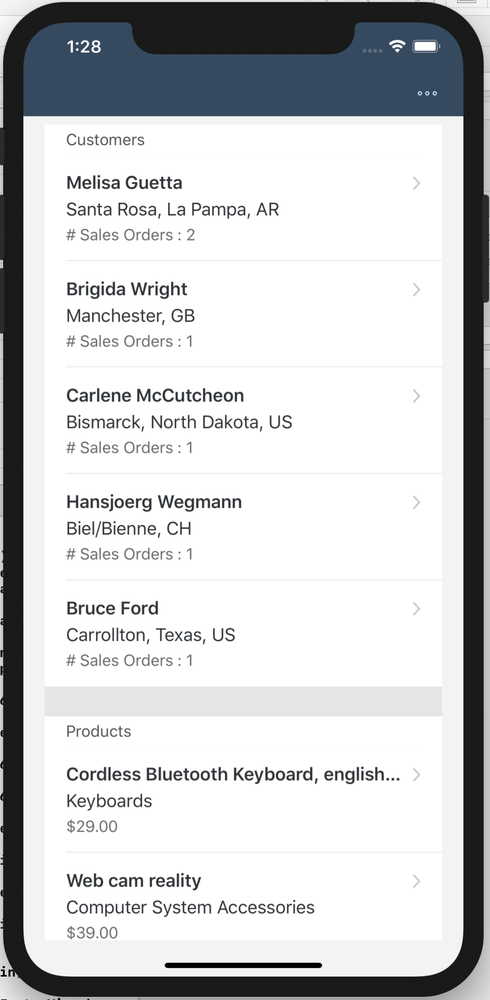
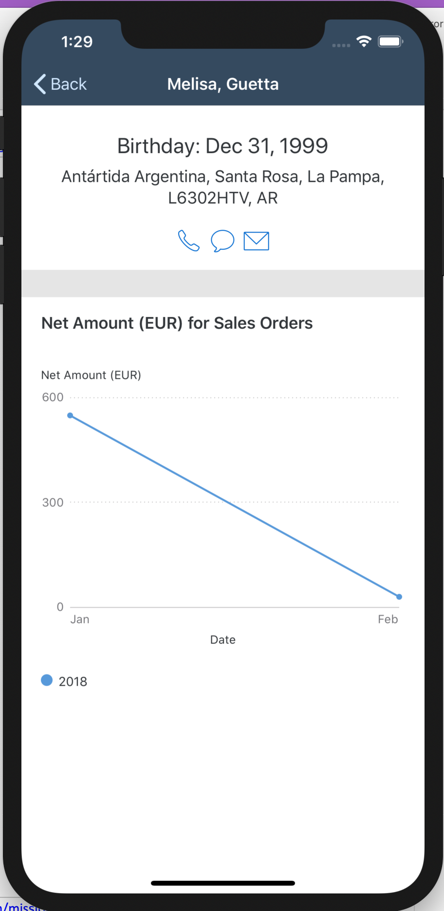
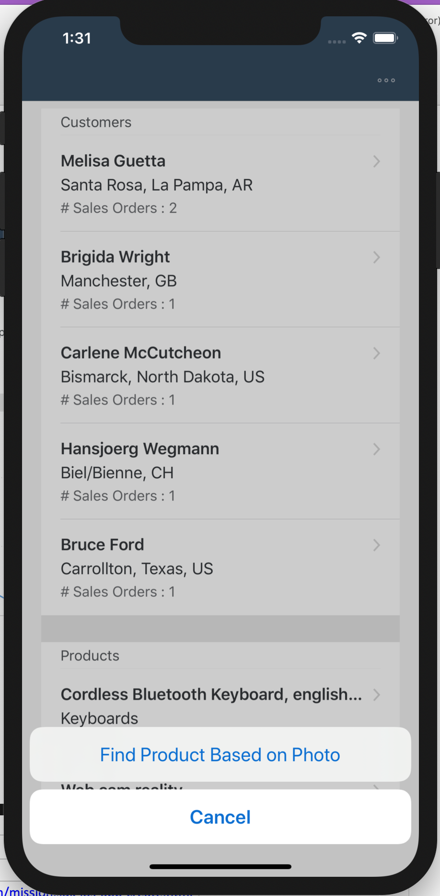
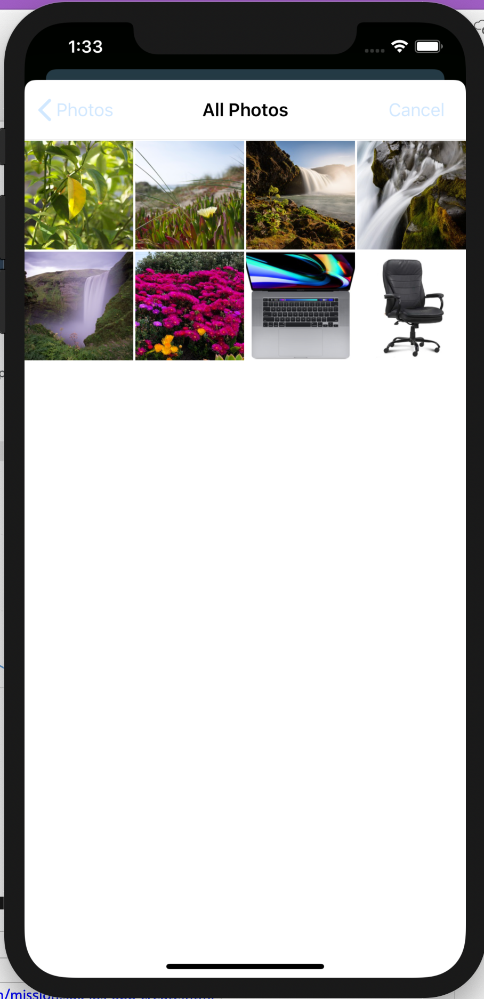
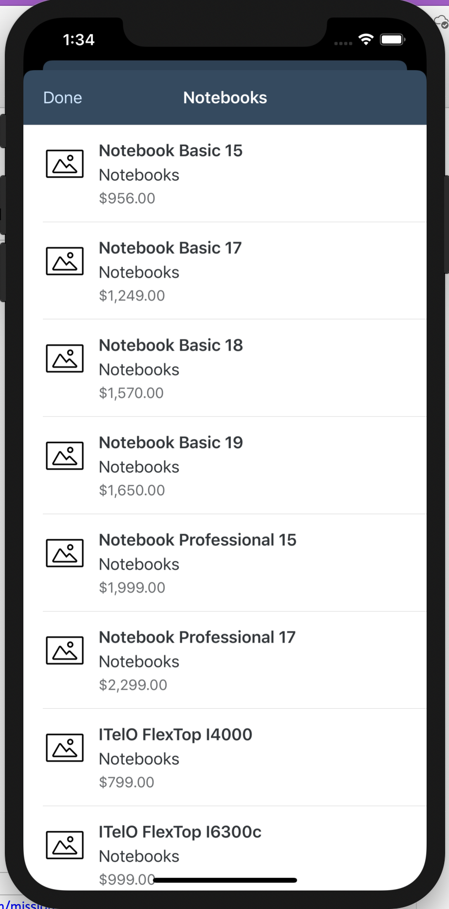

# Sales Assistant App
Use the SAP Cloud Platform SDK for iOS to build an Image Classification app. Learn how to use Create ML to train an Image Classification model and implement the categorization with help of Apple’s Vision framework.  

Based on this SAP TechEd Developer Garage Tutorial Blog 
* https://blogs.sap.com/2020/01/28/ios-teched-missions-available-for-public/

Mission: https://developers.sap.com/mission.sdk-ios-image-classifier.html
 
 Sales Assistant Images
 
 
 
 
 
 
# Generated by the SAP Cloud Platform SDK for iOS Assistant

## This App Project
This project can be used as-is. The source code is not protected by any license and can freely be used without restrictions, just like sample source code on our help pages.
More information about the structure of the generated application can be found on [help.sap.com](https://help.sap.com/viewer/fc1a59c210d848babfb3f758a6f55cb1/3.1/en-US/c14683672e9d4df383e8fced4ea9a019.html).

## Tutorials
Check out these tutorials and courses for deep-dives into various areas
* [Mobile Interactive Tutorials](https://www.sap.com/developer/tutorial-navigator/mobile-interactive-tutorials.html)
* [Community Tutorials](https://www.sap.com/developer/topics/cloud-platform-sdk-for-ios.html)
* [openSAP course](https://open.sap.com/courses/ios2)

## TechEd
Watch SAP TechEd sessions on mobility online at [SAP Teched Online](http://www.sapteched.com/online).
